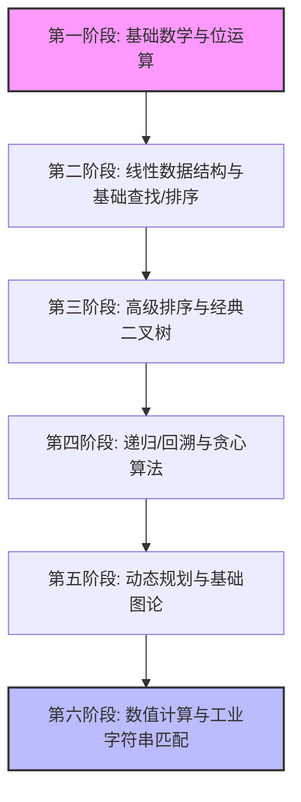

# C++ 新手专属：C-Plus-Plus 仓库渐进式学习路线图

欢迎来到 `TheAlgorithms/C-Plus-Plus`！作为 C++ 新手，直接面对数以百计的高级算法源文件可能会感到无从下手。为了帮助你以最优路径掌握 C++ 语言特性与算法基础，我们为你定制了这份**六阶段渐进式学习路线图**。

每一阶段都规划了**对应的核心 C++ 语法**、**精选推荐源文件**以及**学习重点**。

---

## 🗺 六阶段学习路线图总览



---

## 阶段一：起步走 —— 基础数学、位运算与简单逻辑

本阶段专注于适应 C++ 的基础语法、输入输出以及位运算符。算法逻辑极其简单，是极佳的敲门砖。

### 1. 核心 C++ 语法准备
* 变量定义、基本数据类型（`int`, `double`, `bool`）。
* 条件语句（`if-else`）、循环语句（`for`, `while`）。
* C++ 风格的位运算符（`&`, `|`, `^`, `<<`, `>>`）。

### 2. 推荐学习文件
* **[check_even_odd.cpp](file:///Users/sundust/workspace/C-Plus-Plus/bit_manipulation/check_even_odd.cpp)**：利用位与运算符 `& 1` 快速判断奇偶，体会底层计算。
* **[power_of_2.cpp](file:///Users/sundust/workspace/C-Plus-Plus/bit_manipulation/power_of_2.cpp)**：利用经典公式 `(n & (n - 1)) == 0` 判断 2 的幂，学习位运算妙用。
* **[palindrome_of_number.cpp](file:///Users/sundust/workspace/C-Plus-Plus/others/palindrome_of_number.cpp)**：回文数判断，练习基本的循环取余和数值反转逻辑。

---

## 阶段二：打地基 —— 线性数据结构与基础查找/排序

本阶段你将开始接触 C++ 最核心的基石：**指针、引用以及标准模板库（STL）**，并掌握经典的低阶搜索与排序算法。

### 1. 核心 C++ 语法准备
* 指针基础（`*` 指针声明与 `&` 取地址符）。
* 结构体（`struct`）与类（`class`）定义.
* STL 容器入门：双端动态数组 `std::vector` 的使用。

### 2. 推荐学习文件
* **线性表与链表**：
  * **[linked_list.cpp](file:///Users/sundust/workspace/C-Plus-Plus/data_structures/linked_list.cpp)**：单链表的插入与删除，深度理解指针跳转与内存寻址。
  * **[stack.hpp](file:///Users/sundust/workspace/C-Plus-Plus/data_structures/stack.hpp)** / **[queue.hpp](file:///Users/sundust/workspace/C-Plus-Plus/data_structures/queue.hpp)**：利用 C++ 模板实现泛型栈和队列。
* **基础查找与排序**：
  * **[linear_search.cpp](file:///Users/sundust/workspace/C-Plus-Plus/search/linear_search.cpp)** / **[binary_search.cpp](file:///Users/sundust/workspace/C-Plus-Plus/search/binary_search.cpp)**：线性查找与折半查找，学习区间收缩边界控制。
  * **[bubble_sort.cpp](file:///Users/sundust/workspace/C-Plus-Plus/sorting/bubble_sort.cpp)** / **[insertion_sort.cpp](file:///Users/sundust/workspace/C-Plus-Plus/sorting/insertion_sort.cpp)**：冒泡与插入排序，体会双层嵌套循环的时间复杂度损耗。

---

## 阶段三：中阶挑战 —— 分治法高级排序与二叉树

本阶段难度有所升级。分治法和树形结构是算法面试的绝对高频区。此时你需要重点习惯**递归逻辑**和**树形链接指针**。

### 1. 核心 C++ 语法准备
* 函数的递归调用（调用栈与基准情况）。
* C++ 模板（`template <typename T>`）的高阶应用。
* 内存手动管理（`new` 与 `delete` 的对应使用）。

### 2. 推荐学习文件
* **分治法高级排序**：
  * **[quick_sort.cpp](file:///Users/sundust/workspace/C-Plus-Plus/sorting/quick_sort.cpp)**：快速排序，重点体会“分区（Partition）”思想和原址排序。
  * **[merge_sort.cpp](file:///Users/sundust/workspace/C-Plus-Plus/sorting/merge_sort.cpp)**：归并排序，体会分治归并过程，注意辅助内存的开辟。
* **树形数据结构**：
  * **[binary_search_tree.cpp](file:///Users/sundust/workspace/C-Plus-Plus/data_structures/binary_search_tree.cpp)**：二叉搜索树，重点学习前序、中序、后序遍历的递归实现。
  * **[trie_modern.cpp](file:///Users/sundust/workspace/C-Plus-Plus/data_structures/trie_modern.cpp)**：前缀树（字典树），体会多路树形结构在字符串检索中的应用。

---

## 阶段四：突破自我 —— 递归、回溯与贪心算法

本阶段开始涉及复杂问题的求解策略。你需要编写能够在解空间树中自如搜索与剪枝的深度递归代码。

### 1. 核心 C++ 语法准备
* `std::function` 与 Lambda 匿名函数表达式。
* 引用传递（`&`）在递归回溯中携带全局状态的作用。

### 2. 推荐学习文件
* **回溯（Backtracking）**：
  * **[generate_parentheses.cpp](file:///Users/sundust/workspace/C-Plus-Plus/backtracking/generate_parentheses.cpp)**：括号生成，最直观的回溯起步，理解左/右括号的数量约束。
  * **[n_queens.cpp](file:///Users/sundust/workspace/C-Plus-Plus/backtracking/n_queens.cpp)**：经典 N 皇后问题，学习如何使用二维棋盘回溯状态并进行对角线碰撞剪枝。
* **贪心算法（Greedy）**：
  * **[knapsack.cpp](file:///Users/sundust/workspace/C-Plus-Plus/greedy_algorithms/knapsack.cpp)**：部分背包问题，理解“性价比排序”的贪心选择策略。
  * **[huffman.cpp](file:///Users/sundust/workspace/C-Plus-Plus/greedy_algorithms/huffman.cpp)**：赫夫曼编码，体会通过最小堆优先队列构建最优前缀树的过程。

---

## 阶段五：高阶实战 —— 动态规划与图论算法

这是程序员的分水岭。动态规划（DP）考察对状态转移的洞察；图论则代表了计算机科学解决社交网络、导航路线等现实问题的核心逻辑。

### 1. 核心 C++ 语法准备
* 二维动态数组（`std::vector<std::vector<T>>`）的嵌套使用。
* STL 哈希表（`std::unordered_map`）、集合（`std::unordered_set`）与优先队列（`std::priority_queue`）。

### 2. 推荐学习文件
* **动态规划（DP）**：
  * **[coin_change.cpp](file:///Users/sundust/workspace/C-Plus-Plus/dynamic_programming/coin_change.cpp)**：零钱兑换，非常经典的完全背包变体，理解自底向上的状态表更新。
  * **[0_1_knapsack.cpp](file:///Users/sundust/workspace/C-Plus-Plus/dynamic_programming/0_1_knapsack.cpp)**：0-1 背包问题，通过二重循环推导物品选择决策。
* **图论算法（Graph）**：
  * **[depth_first_search.cpp](file:///Users/sundust/workspace/C-Plus-Plus/graph/depth_first_search.cpp)** / **[breadth_first_search.cpp](file:///Users/sundust/workspace/C-Plus-Plus/graph/breadth_first_search.cpp)**：图的 DFS 和 BFS 遍历，核心要掌握邻接表表达以及 `visited` 数组防死循环。
  * **[dijkstra.cpp](file:///Users/sundust/workspace/C-Plus-Plus/graph/dijkstra.cpp)**：单源最短路径，重点学习如何通过 `std::priority_queue` 优化边松弛的查找速度。
  * **[kruskal.cpp](file:///Users/sundust/workspace/C-Plus-Plus/graph/kruskal.cpp)**：最小生成树，体会并查集（DSU）在边集合成树过程中的判定作用。

---

## 阶段六：工业级拓展 —— 数值计算与字符串高级匹配

当你跨过前五阶段，你已经掌握了通用算法知识。本阶段将带你领略更偏向数学物理的数值计算，以及极其精妙的字符串进阶查找算法。

### 1. 推荐学习文件
* **数值计算（Numerical Methods）**：
  * **[babylonian_method.cpp](file:///Users/sundust/workspace/C-Plus-Plus/numerical_methods/babylonian_method.cpp)**：牛顿迭代法求平方根，体会连续函数的数值收敛逼近。
  * **[gaussian_elimination.cpp](file:///Users/sundust/workspace/C-Plus-Plus/numerical_methods/gaussian_elimination.cpp)**：高斯消元法解线性方程组，理解矩阵消元与行交换（列主元）的工程稳定性防卫。
* **字符串匹配（Strings）**：
  * **[knuth_morris_pratt.cpp](file:///Users/sundust/workspace/C-Plus-Plus/strings/knuth_morris_pratt.cpp)**：经典 KMP 匹配，理解部分匹配表（Next 数组）如何避免指针无谓的回溯，体会滑动窗口的高级形态。

---

## 💡 C++ 算法学习路线实用建议

1. **不要只用眼睛看，必须手动调试一遍**：
   你可以直接用命令行编译文件。例如对于 `binary_search.cpp`：
   ```bash
   g++ -std=c++17 search/binary_search.cpp -o binary_search
   ./binary_search
   ```
2. **在脑海中单步执行递归**：
   在看 `n_queens.cpp` 或二叉树遍历时，可以拿一张纸，画出每一层递归调用的参数变化和压栈出栈状态。
3. **利用好我们最近添加的中文注释与 Bug 审计记录**：
   在本仓库的近 150 个核心文件中，我们都重构了不安全的内存漏洞（如 Chaining 哈希表的数组越界、FFT 的原始指针泄漏等），并附带了详细 of 中文逻辑原理解析与修正备注。阅读这些文件的历史修改（`git log -p` 或直接阅读代码首部的 `@note`）能让你直接学到防范 C++ 坑点的宝贵工程经验。
